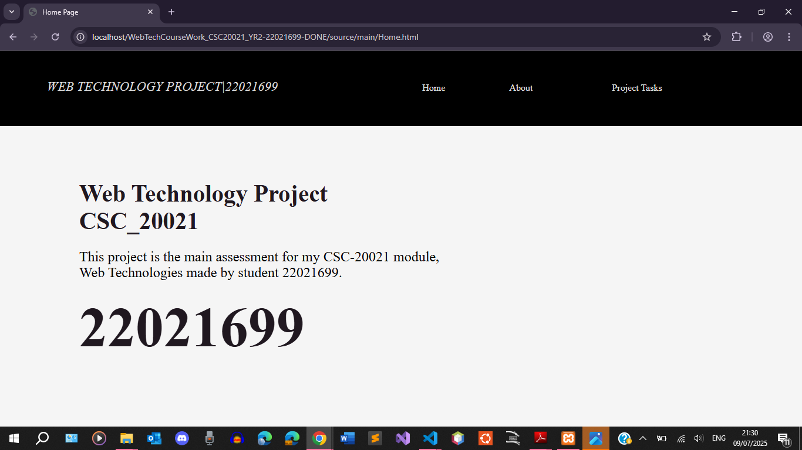
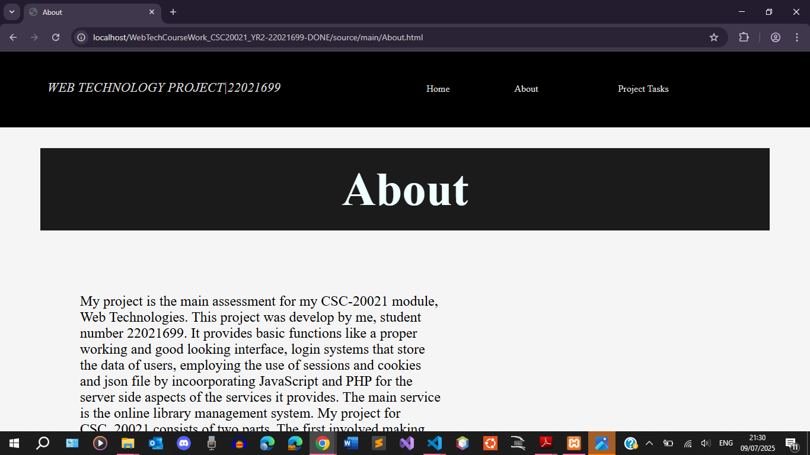
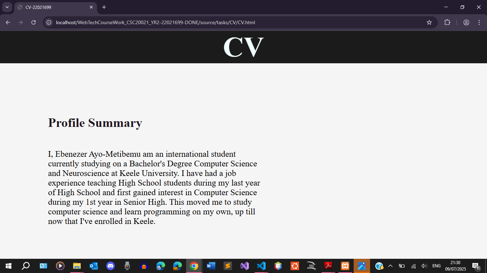
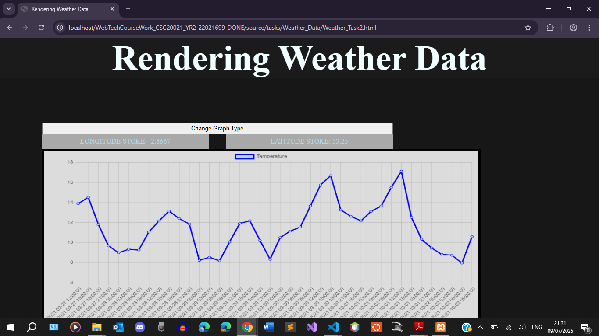
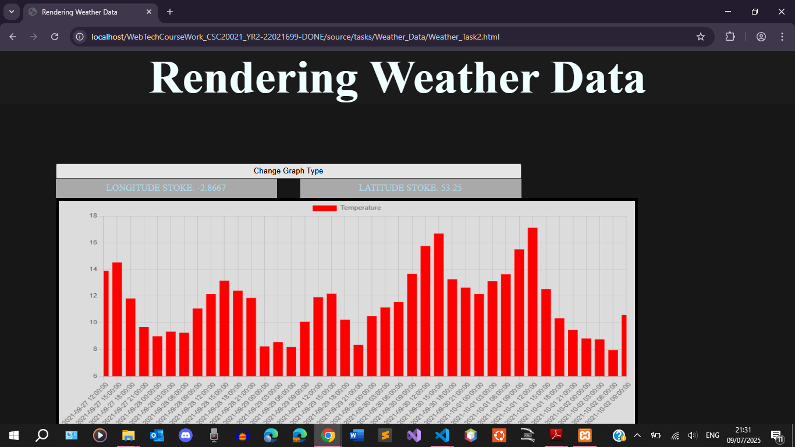
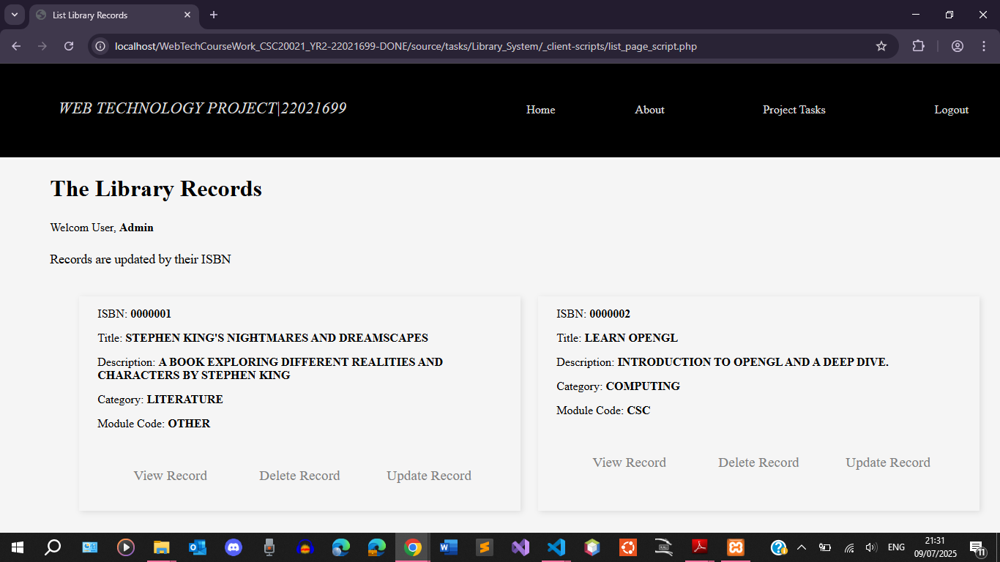
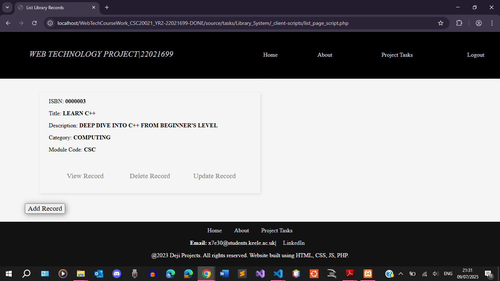

##	Web Technology Module Year Coursework: Library System and Data Visualizer

##	About

Written using PHP and HTML, JS, and CSS. Includes use of ReactJS, the Fetch API, asynchronous javascript programming, and JS Canvas. Weather data was visualized using JavaScript and a library system that saves library records is implemented uing a PHP backend.

##	Screenshots

